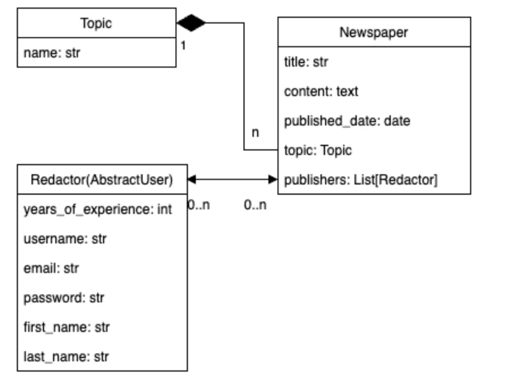

# NewsFlow 📰

NewsFlow is a system for tracking newspaper issues, editors in charge, and the topics covered in each release. It provides a comprehensive platform for managing editorial workflows and content organization.

## Check it out!

[NewsFlow deployed to Render](https://newsflow-75um.onrender.com/)

###### Test credentials:
###### login: Admin
###### password: 1qazcde3

## Features

- 📋 **Issue Management** - Track and organize newspaper issues
- 👥 **Editor Assignment** - Assign editors to specific newspapers and topics
- 📝 **Topic Tracking** - Monitor topics covered in each release
- 🔐 **User Authentication** - Secure login and authorization system
- 📊 **Dashboard** - Overview of all newspapers, editors, and topics
- 🎨 **Modern UI** - Clean and intuitive interface


## Installation

1. **Clone the repository**
```shell
git clone https://github.com/DanuloM/NewsFlow.git
cd NewsFlow
```

2. **Create a virtual environment and install requirements**
> If you are using PyCharm - it may propose you to automatically create venv for your project 
and install requirements in it, but if not:
```shell
python -m venv venv
venv\Scripts\activate # on Windows
source venv/bin/activate # on macOS/Linux
pip install -r requirements.txt
```

3. **Set up environment variables (Optional)**
```shell
# Create .env file if needed for production settings
```

4. **Run migrations**
```shell
python manage.py migrate
```

5. **(Optional) Load fixture data**
> Note: All users' passwords will not work, so you may need to create a superuser using `python manage.py createsuperuser` or modify users via ORM.
```shell
python manage.py loaddata newsflow/fixtures/dump.json
```

6. **Run the development server**
> If you are using PyCharm, it may automatically configure the Run option (Shift+F10 by default). If not, run:
```shell
python manage.py runserver
```

The application will be available at `http://localhost:8000`

## Database Structure




## Technologies Used

- **Backend**: Django 5.27+
- **Database**: SQLite (development) / PostgreSQL (production)
- **Frontend**: HTML, CSS, JavaScript, Bootstrap
- **Authentication**: Django built-in authentication system
- **Deployment**: Render


Create a superuser to access admin:
```shell
python manage.py createsuperuser
```

## Testing

Run tests with:
```shell
python manage.py test
```


---

⭐ If you like this project, please give it a star!